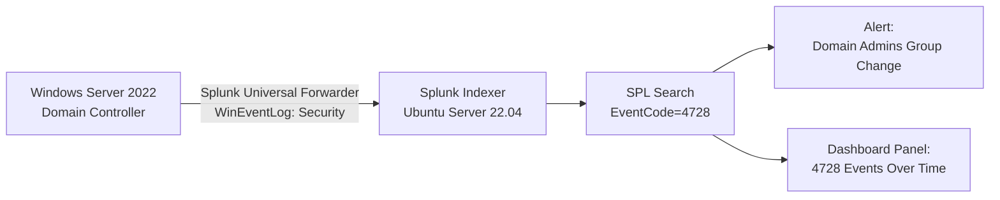

# Splunk SIEM Deployment (Project 02)

## Objective

Deploy Splunk Enterprise as a centralized SIEM on Ubuntu Server, forward Windows Security event logs from the Active Directory host built in Project 01, and build detection content (search, alert, dashboard) around Event ID 4728 — a member being added to a privileged Active Directory group.

## Environment

- **Splunk indexer:** Ubuntu Server 22.04 LTS, Splunk Enterprise 10.4.2 (trial license), deployed in Azure
- **Log source:** Windows Server 2022 domain controller from Project 01, running the Splunk Universal Forwarder
- **Network:** Both VMs in Azure; forwarder configured to ship data to the indexer over TCP 9997

## Architecture



## Steps Performed

1. Provisioned an Ubuntu Server 22.04 VM in Azure, in the same resource group as the Project 01 AD VM.

   

2. Hardened SSH access: created a non-root sudo user (`splunkadmin`) and explicitly set `PermitRootLogin no` in `sshd_config`, disabling direct root login over SSH. This matters because a compromised root credential over SSH gives an attacker unrestricted access with no accountability trail — forcing sudo-based access means every privileged action is tied to a named account and logged.

   

3. Installed Splunk Enterprise (trial license) via the `.deb` package, started the service, and created admin credentials through the web UI on port 8000.
4. Installed the Splunk Universal Forwarder on the Windows Server 2022 domain controller, configured it to monitor the Windows Security event log, and pointed it at the Splunk indexer.

   

5. Confirmed Windows Security events were arriving in Splunk with:
   ```
   index=* sourcetype=WinEventLog:Security
   ```

   

6. Built a search isolating the specific event of interest — a member being added to a security-enabled global group (Domain Admins):
   ```
   index=* sourcetype=WinEventLog:Security EventCode=4728
   ```

   

7. Saved that search as a scheduled alert (runs every 5 minutes, triggers when results > 0), and confirmed it fired against a live test event.

   
   

8. Built a dashboard panel (column chart) visualizing EventCode=4728 occurrences over time.

   

## Screenshots

All screenshots sit directly in this folder — Azure public/private IPs redacted throughout.

| File | Description |
|---|---|
| `Image 1.png` | `splunk status` confirming splunkd running on the indexer |
| `Image 2.png` | `sshd_config` showing `PermitRootLogin no` |
| `Image 3.png` | Search results for all Windows Security events flowing in |
| `Image 4.png` | Task Manager showing the SplunkForwarder service running on the DC |
| `Image 5.png` | The EventCode=4728 search and a matching event (Domain Admins group change) |
| `Image 6.png` | The alert's schedule and trigger condition |
| `Image 7.png` | The finished dashboard panel showing 4728 events over time |
| `Image 8.png` | Trigger history showing the alert firing repeatedly on its 5-minute schedule |

## Lessons Learned

- **Overlapping Azure VNets can silently break private connectivity.** Two VMs provisioned separately can end up in different, non-peerable Virtual Networks that happen to share the same default address space (e.g., `172.16.0.0/24`). Private-IP traffic between them will look reachable — ICMP ping succeeds instantly — but every TCP connection fails, because each VM is actually just reaching itself. Diagnosing this required systematically ruling out the OS firewall (`ufw`), Windows Defender Firewall, and both VMs' NSGs before comparing interface IPs directly. The practical fix for a lab environment was forwarding over public IPs instead of re-architecting the VNets.
- **Splunk won't auto-start as root without an explicit flag, and that breaks naive boot-start setups.** Recent Splunk versions refuse to launch as root unless you pass `--run-as-root`, but the default `enable boot-start` init script doesn't include that flag — so splunkd silently fails to come up on every reboot. The correct fix (also the security best practice) was creating a dedicated non-root `splunk` service account and reconfiguring boot-start as a proper systemd unit running under that account.
- **Display settings and underlying data are separate failure points.** A 4-hour timestamp mismatch between Splunk's UI and the raw Windows event text turned out to be a per-user display timezone setting defaulting to the indexer's own OS timezone (UTC) — not corrupted data. It also didn't take effect until a full logout/login, since Splunk loads timezone into the session at login rather than re-reading it live.
- **Small file-saving mistakes can masquerade as major infrastructure problems.** An `inputs.conf` file silently saved by Notepad as `inputs.conf.txt` (a classic Windows extension-hiding issue) meant the forwarder had nothing configured to collect, even after connectivity, receiving ports, and the service itself were all confirmed working. Worth checking the simple, boring possibilities before chasing complex network theories.
- **Manual restarts hide problems that only show up on a genuine reboot.** Both the boot-start and forwarder-service issues above only surfaced when testing with an actual Azure stop/start cycle — a manual `splunk start` or `Restart-Service` always "worked," masking the fact that neither would come back on its own after a real reboot. Any infrastructure fix should be validated with a true restart, not just a manual invocation.
